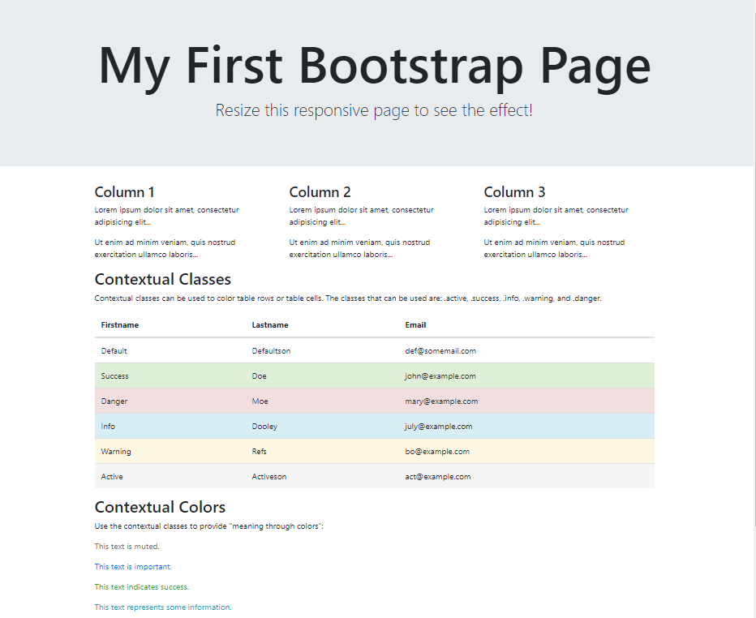
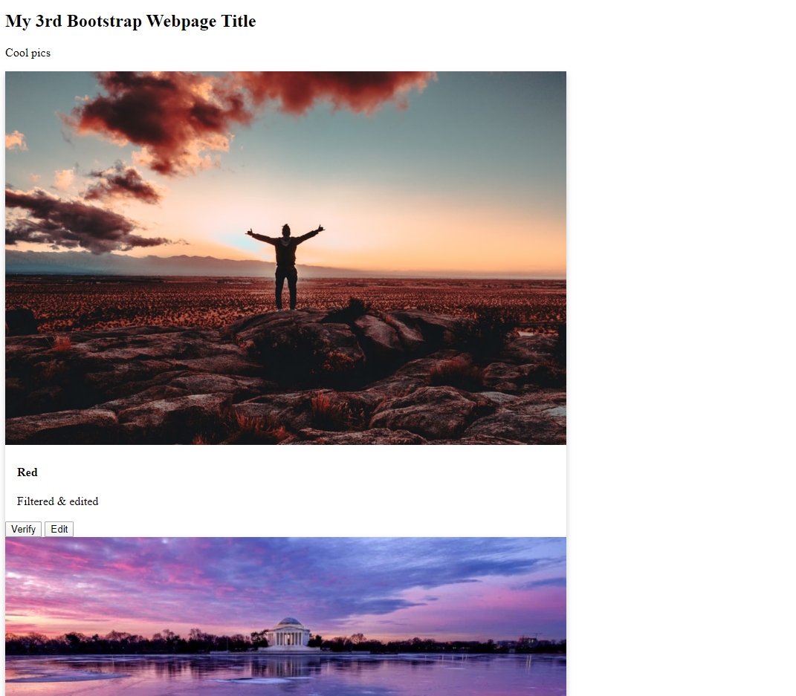
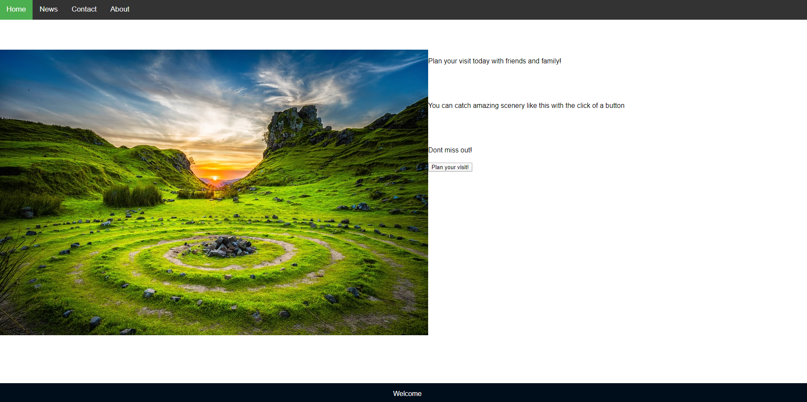

<!DOCTYPE html>
<html lang="en">
<head>
<meta charset="utf-8">
<title>AvidsDev</title>
<!-- Mobile Specific Metas -->
<meta name="viewport" content="width=device-width, initial-scale=1.0">
<meta name="description" content="">
<meta name="author" content="">
<meta http-equiv="X-UA-Compatible" content="IE=edge,chrome=1">

<!-- CSS files begin-->
<link href='http://fonts.googleapis.com/css?family=Oswald:400,300,700|Open+Sans+Condensed:700,300,300italic|Open+Sans:400,300italic,400italic,600,600italic,700,700italic,800,800italic|PT+Sans:400,400italic,700,700italic' rel='stylesheet' type='text/css'>
<link href="assets/css/bootstrap.css" rel="stylesheet">
<link href="assets/css/font-awesome.css" rel="stylesheet" >
<link href="assets/css/bootstrap-responsive.css" rel="stylesheet">
<link href="assets/css/docs.css" rel="stylesheet">
<link href="assets/js/google-code-prettify/prettify.css" rel="stylesheet">
<link href="assets/css/responsiveslides.css" rel="stylesheet">
<link rel="stylesheet" href="assets/css/prettyPhoto.css" type='text/css'>
<link rel="stylesheet" href="assets/build/mediaelementplayer.min.css" />
<!--[if lt IE 9]><link rel="stylesheet" type="text/css" media="screen" href="assets/css/slide-in.ie.css" /><![endif]-->
<!--[if lte IE 8]><link rel="stylesheet" type="text/css" href="assets/css/ie.css" /><![endif]-->
<link href="assets/css/style.css" rel="stylesheet">

<!-- HTML5 shim, for IE6-8 support of HTML5 elements -->
<!--[if lt IE 9]>
      
    <![endif]-->

<!-- fav and touch icons -->
<link rel="shortcut icon" href="assets/ico/favicon.ico">
<link rel="apple-touch-icon-precomposed" sizes="144x144" href="assets/ico/apple-touch-icon-144-precomposed.png">
<link rel="apple-touch-icon-precomposed" sizes="114x114" href="assets/ico/apple-touch-icon-114-precomposed.png">
<link rel="apple-touch-icon-precomposed" sizes="72x72" href="assets/ico/apple-touch-icon-72-precomposed.png">
<link rel="apple-touch-icon-precomposed" href="assets/ico/apple-touch-icon-57-precomposed.png">
</head>

<body>
<!-- Head
================================================== -->

 

  
  
 

 
   
 

<!-- Logo / Menu
================================================== -->
<header class="header">
  

    

      
  

      

       <nav>
                <ul class="right">
                    <li> <a href="index.html"> home </a>
                    <ul>
                        <li> <a href="index_1.html"> Home Page</a>  </li>
                        
                      </ul>
                  </li>
                    <li> <a href="about.html"> about </a> </li>
                    <
                    <ul>
                        
                        
                        
                        
                        <ul>
                            
                          </ul>
                      </li>
                      </ul>
                  </li>
                    <li> <a href="blog.html"> blog </a> 
                    <ul>
                        <li> <a href="single-post.html"> Instagram </a> 
                        <ul>
                            
                          </ul>
                      </li>
                      </ul>
                  </li>
                    <li> <a href="contact.html"> contact </a> 
                    <ul>
                        <li> <a href="contact_2.html"> Email <em>Marquisgray6@gmail.com</em></a> </li>
                        </ul> </li>
                  </ul>
              </nav>
      

    

  

</header>

<header id="pagehead">

<h1>Portfolio <small>Avid's amateur dev things </small></h1>

 

            <ul class="filter-data" data-option-key="filter" style="margin-bottom:0; margin-top:5px;" >
              <li> <a href="#filter" title="" class="currents selected" data-option-value="*">All</a> </li>
             
            </ul>
          

          

</header>

 

<!-- Portfolio filter
================================================== -->
<section>
  
<!-- Portfolio item
================================================== -->
 
<ul class="thumbnails portfolio" id="containment-portfolio">
    <li class="span6 item-block web all">
     
      
      
    </li>
    <li class="span6 item-block video all">
     
      

      

    </li>
   <li class="span6 item-block web all">
     
    
      
      

      <a href="Previous work"> Previous work </a>
       
 <em>Amateur</em> 

      

    </li>
    <li class="span6 item-block">
     
     
      
      
    </li>
    

      
      

    </li>
    <li class="span6 item-block video all">
     

      

    
     

     

     </li>
    
  </ul>
</section>
  

    
<!-- /container -->

     <!-- Footer
      ================================================== -->
      <footer>
      

      

      
      

      <h3>About</h3>
      
This is the beginning stages of my website will be updated as more work is produced. Dev and art things to come!

      <h3>Connect With Us</h3>
      <!-- social begin here -->
                    <ul class="socicon left">
                       <li>
                            
                        </li>
                        <li>
                            
                        </li>
                        <li>
                            
                        </li>
                        <li>
                            
                        </li>
                        <li>
                            
                        </li>
                        <li>
                            
                        </li>
                        <li>
                            
                        </li>
                        <li class="last">
                            
                        </li>
                       
                    </ul>
                    
      

      
      <!-- tweets begin here -->
      

      <h3>Latest Tweets</h3>
       

                        

                            Loading Tweets...
                        

                        <ul id="tweet-list">
                        </ul>
                    

      

      
      

      <!-- flickr begin here -->
      <h3>From Instagram</h3>
      
      
      

      
      

       &copy; 2019 AvidDev. All Rights Reserved.
      

      

      

      </footer>

    <!-- JavaScript files begin-->
    <!-- Placed at the end of the document so the pages load faster -->
    
    
    
    
    
    
    
    
    
    
    
    
    
    
    
    
    
    
    

  </body>
</html>
